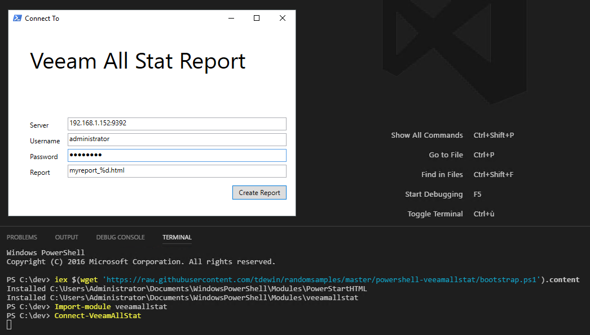
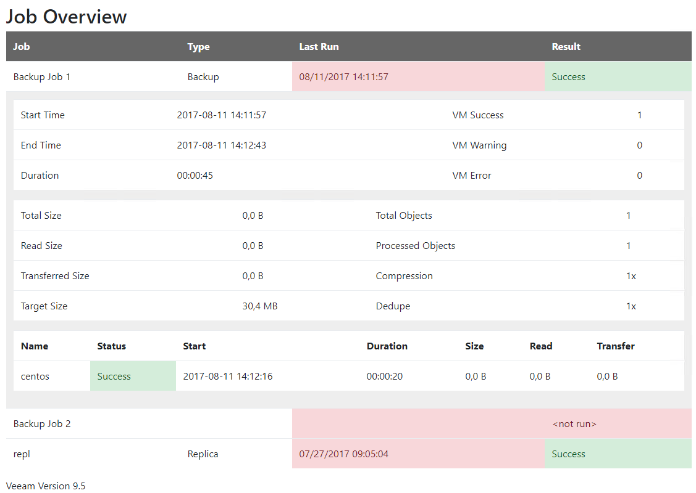

# Installing
Does require the veeam powershell module to be installed and powershellstart (later will be downloaded as well)
```powershell
iex $(wget 'https://raw.githubusercontent.com/tdewin/randomsamples/master/powershell-veeamallstat/bootstrap.ps1').content
```

# Using
GUI
```powershell
Import-module veeamallstat
Connect-VeeamAllStat
```

Via code
```powershell
Import-module veeamallstat
Add-pssnapin veeampssnapin
Connect-VBRServer -server $server -Credential  $credentials
New-VeeamAllStatReport
```

Build your own
```powershell
Import-module veeamallstat
Add-pssnapin veeampssnapin
Connect-VBRServer -server $server -Credential  $credentials
$stats = Get-VeeamAllStat
$stats
```


# Screenshots

