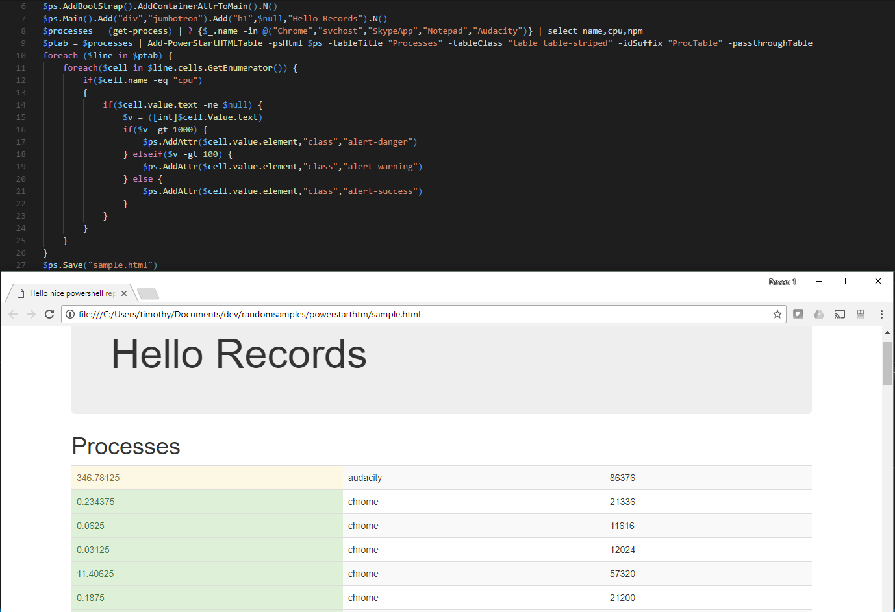

# Powerstart HTML Tryout
Combining bootstrap with powershell (cause out-html looks ugly anyway)


```powershell
$ps = [PowerStartHTML]::new("Hello nice powershell report!")
$ps.AddBootStrap().AddContainerAttrToMain().N()
$ps.Main().Add("div","jumbotron").Add("h1",$null,"Hello Records").N()
$processes = (get-process) | ? {$_.name -in @("Chrome","svchost","SkypeApp","Notepad","Audacity")} | select name,cpu,npm 
$ptab = $processes | Add-PowerStartHTMLTable -psHtml $ps -tableTitle "Processes" -tableClass "table table-striped" -idSuffix "ProcTable" -passthroughTable
foreach ($line in $ptab) {
    foreach($cell in $line.cells.GetEnumerator()) {
        if($cell.name -eq "cpu")
        {
            if($cell.value.text -ne $null) {
                $v = ([int]$cell.Value.text)
                if($v -gt 1000) {
                    $ps.AddAttr($cell.value.element,"class","alert-danger")
                } elseif($v -gt 100) {
                    $ps.AddAttr($cell.value.element,"class","alert-warning")
                } else {
                    $ps.AddAttr($cell.value.element,"class","alert-success")
                }
            } 
        }
    }
}
$ps.Save("sample.html")
```

[Download Sample](https://raw.githubusercontent.com/tdewin/randomsamples/master/powerstarthtm/sample.html)