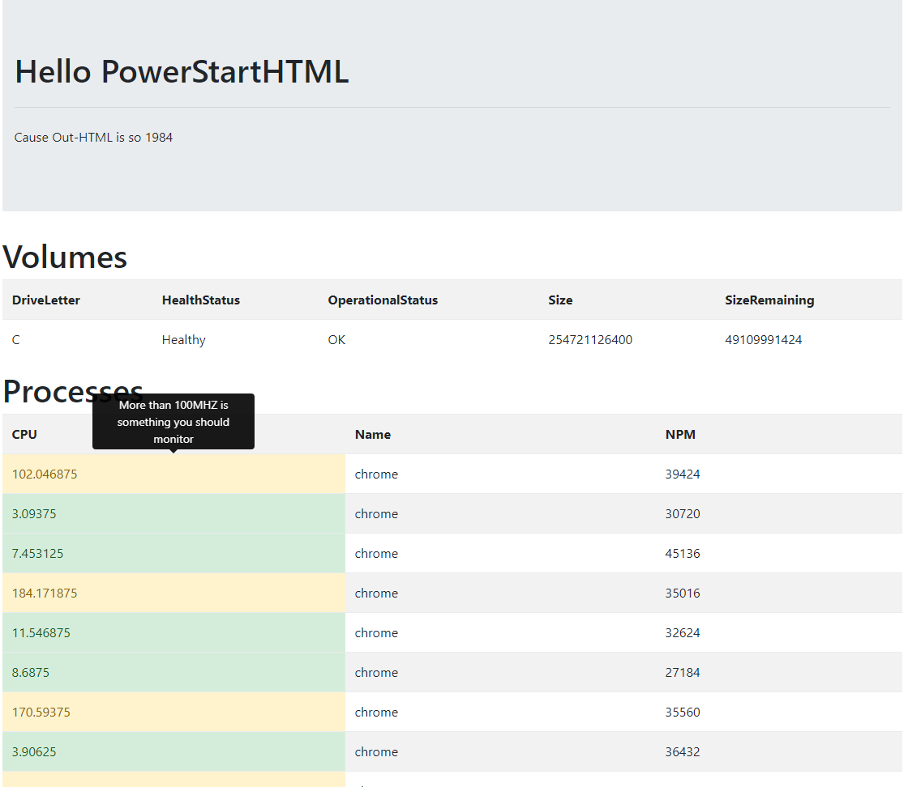

# Powerstart HTML Tryout
Combining bootstrap with powershell (cause out-html looks ugly anyway)

The PowerStartHTML class will remember the last add element, so you can just keep Adding and adding. 


```
Add(type,class,text)
Append(type,class,text)
````
The difference between Add is that it will remember the new element as the as the element. With Append, it remember the parent, so you can add an element at the same depth

* If you want to split but don't want to return the document, end your command with .N() (basically does nothing)
* Use Main() to get back to the main div
* Use Up() to go up one level
* Use Add-PowerStartHTMLTable to convert a complete pipeline to an html table (can also be done manually but this is easier)
* AddBootStrap().AddContainerAttrToMain() to link bootstrap at compile
* You can use $ps.onLoadJS.Add() to add a javascript comment that will be executed at launching the doc
* You can use $pshtmlvar.AddAttrs(name,hashtable) to add attributes to an element. To refer to the newest element you can check $pshtmlvar.newEl. To refer to the working element you can use $pshtmlvar.lastEl

Here is some sample code which is pretty advanced since it will create tooltips etc.

```powershell
get-module powerstarthtml | remove-module
import-module PowerStartHTML
$ps = New-PowerStartHTML -title "Hello PowerStartHTML!"
#$ps.indentedOutput = $true
$ps.AddBootStrap().AddContainerAttrToMain().N()
$ps.Main().Add("div","jumbotron jumbotron-fluid").Add("div","container").N()
$ps.Append("h1",$null,"Hello PowerStartHTML").Append("hr","my-4").Append("p",$null,"Cause Out-HTML is so 1984").N()
get-volume | select DriveLetter,HealthStatus,OperationalStatus,SizeRemaining,Size | Add-PowerStartHTMLTable -psHtml $ps -tableTitle "Volumes" -tableClass "table table-striped"
$processes = (get-process) | ? {$_.name -in @("Chrome","svchost","SkypeApp","Notepad","Audacity")} | select name,cpu,npm 
$processes | Add-PowerStartHTMLTable -psHtml $ps -tableTitle "Processes" -tableClass "table table-striped" -idOverride "ProcTable" -passthroughTable | % {
    $row = $_
    foreach($cell in $row.cells.GetEnumerator()) {
        if($cell.name -eq "cpu")
        {
            if($cell.value.text -ne $null) {
                $v = ([int]$cell.Value.text)
                if($v -gt 1000) {
                    $ps.AddAttrs($cell.value.element,@{
                        "class"="alert-danger";
                        "data-toggle"="tooltip";
                        "data-placement"="top";
                        "title"="More than 1000MHZ is abnormal"
                    })
                } elseif($v -gt 100) {
                    $ps.AddAttrs($cell.value.element,@{
                        "class"="alert-warning";
                        "data-toggle"="tooltip";
                        "data-placement"="top";
                        "title"="More than 100MHZ is something you should monitor"
                    })
                } else {
                    $ps.AddAttrs($cell.value.element,@{
                        "class"="alert-success";
                        "data-toggle"="tooltip";
                        "data-placement"="top";
                        "title"="Below 100Mhz"
                    })
                }
            } 
        }
    }
}
$ps.onLoadJS.Add('console.log("Hello World")')
$ps.onLoadJS.Add(' $(''[data-toggle="tooltip"]'').tooltip()');
$ps.Save("sample.html")
```





[Download Sample](https://raw.githubusercontent.com/tdewin/randomsamples/master/powerstarthtm/sample.html)